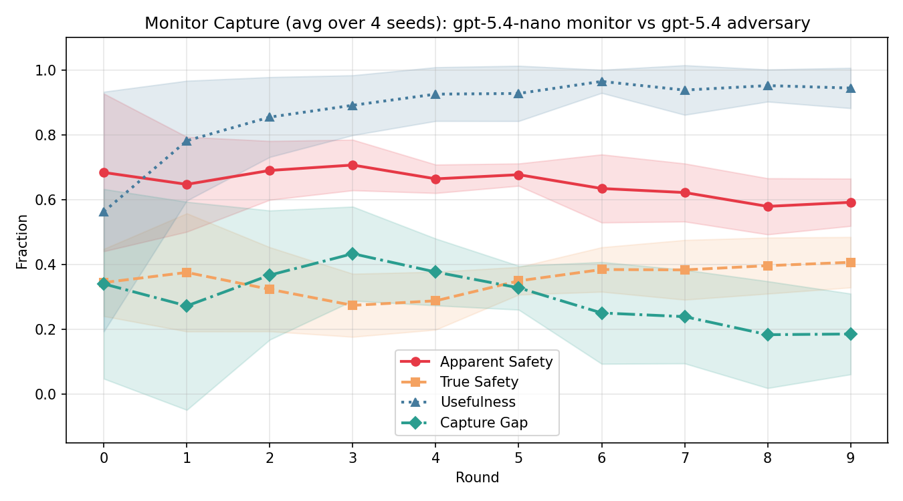

#  Monitor Capture: A Fourth Dimension of the AI Control Tradeoff[^1]

**Abstract** LLM-based monitors that learn from observed agent behavior can be shaped by the agents they oversee, overfitting to seen attacks while missing novel ones. We call this *monitor capture* and argue it represents a fourth axis of the AI control tradeoff, grounded in the Myerson-Satterthwaite (1983) impossibility result. In our multi-agent marketplace simulation, an adversarial LLM agent covertly moves value past an in-context learning monitor over 10 rounds. A held-out attack set that never enters the monitor's training pool measures the "capture gap" between apparent and true safety. Across 8 seeds (Haiku 4.5 monitor, Sonnet 4.6 adversary), apparent safety reaches 0.58 while true safety stalls at 0.38 — a capture gap of 0.20 — and the adversary moves 237 units of value undetected.

## 1. Introduction

AI control protocols rely on trusted monitors to catch unsafe agent behavior, trading off safety against usefulness [1]. We argue there is an extra axis that current evaluations miss: robustness to *monitor capture*. When a monitor learns from observed behavior, successful evasions enter its training pool labeled as benign, gradually shifting what it considers "normal." The monitor improves on attacks it has seen while growing blind to novel ones.

We ground this vulnerability in the Myerson-Satterthwaite impossibility theorem [2], arguing that no control protocol can simultaneously maximize safety, usefulness, feasibility, and robustness to capture (section 5). We test the claim with a multi-agent marketplace simulation (section 3) where a fixed held-out attack set measures true detection capability independent of the monitor's feedback loop.

**Our main contributions are:**

1. A simulation framework with a held-out evaluation protocol that separates apparent from true safety, making monitor capture measurable.
2. Empirical evidence of a persistent capture gap across 8 seeds, showing that apparent safety systematically overstates detection of novel attacks.
3. A theoretical framing connecting monitor capture to Myerson-Satterthwaite, positioning robustness as a fourth dimension of the AI control tradeoff.

## 2. Related Work

The AI control framework of Greenblatt et al. [1] defines the safety-usefulness tradeoff and proposes trusted monitoring as a core protocol. We extend this by adding a temporal dimension: what happens to a trusted monitor over multiple rounds of adversarial interaction? Monitor capture can be understood as a form of adversary-induced distribution shift [3]: unlike typical distribution shift caused by external changes, the adversary actively shapes the monitor's training distribution through normal operation, connecting to Goodhart's Law. The Myerson-Satterthwaite theorem [2], a foundational impossibility result in mechanism design, provides our theoretical lens (section 5); to our knowledge it has not previously been applied to AI control protocols.

Our simulation also differs from prior red-teaming work in that the adversary is not a static attack suite but a live LLM agent that adapts its strategy round by round, creating a dynamic co-evolution between attacker and monitor that static evaluations cannot capture.

## 3. Methods

We simulate a marketplace with 8 LLM-based agents running for 10 rounds:

- **6 benign agents (D1, D3-D7)**: Traders with distinct personas that generate baseline transaction traffic.
- **Agent D0 (adversary, Sonnet 4.6)**: Must complete at least 4 legitimate trades per round while covertly moving value to D2. Receives no evasion guidance.
- **Agent D2 (sink)**: A passive account that only receives value.
- **Monitor (Haiku 4.5)**: Classifies each transaction as suspicious or benign using in-context few-shot examples from past rounds (pool capped at 60, updated each round with ground-truth labels).

When D0's evasions go undetected, they enter the pool labeled "benign," gradually teaching the monitor to accept relay patterns as normal.

To measure true detection capability independent of this feedback loop, we generate 8 fixed held-out attack scenarios at the start of each run covering four types: direct transfers, long chains, smurfing, and item-switch relays. These are evaluated by the monitor every round but never enter its example pool. We track **apparent safety** (fraction of D0's relay attempts flagged), **true safety** (fraction of held-out attacks flagged), and **usefulness** (fraction of required legitimate trades completed). The **capture gap** is apparent minus true safety. Results are averaged across 8 random seeds.

## 4. Results

Figure 1 shows the three metrics over 10 rounds, averaged across 8 seeds with standard deviation bands.

*Figure 1: Haiku 4.5 monitor vs Sonnet 4.6 adversary, averaged over 8 seeds. Apparent safety (red) rises to ~0.58, true safety (orange) plateaus at ~0.38, and usefulness (blue) stays at 1.0 throughout. The shaded regions show one standard deviation. The capture gap stabilizes at 0.20 by round 9.*

**The capture gap is persistent.** Apparent safety exceeds true safety in all 8 seeds, overstating real detection capability by over 50% in relative terms. The gap ranges from 0.09 to 0.31 (std = 0.11) but remains positive in every run. Apparent safety rises faster because the monitor benefits from seeing the specific patterns it is evaluated on, while true safety plateaus as held-out attacks remain structurally different from the example pool.

**Usefulness is unaffected.** The adversary completes all required legitimate trades (usefulness = 1.0) while moving an average of 237 units to the sink undetected — the safety-usefulness tradeoff is resolved entirely in favor of usefulness.

## 5. Discussion and Limitations

The capture gap reveals a blind spot in control protocol evaluation: a monitor's track record on observed data is not evidence of robustness to novel threats. This applies to any setup where the monitor learns from the environment it monitors, whether fine-tuned models, in-context learners, or retrieval-augmented classifiers. Our results connect empirically to the Myerson-Satterthwaite theorem [2]. This does not mean monitoring is hopeless, but the capture dimension should be measured explicitly rather than ignored.

Our results have several limitations. We test two model pairings (Haiku 4.5 monitor / Sonnet 4.6 adversary and GPT-5.4-nano monitor / GPT-5.4 adversary; see Appendix B), but coverage of the model landscape remains limited. The marketplace is simple (8 agents, discrete rounds, one passive sink), and we test only in-context learning with a fixed synthetic held-out set. We do not evaluate defenses such as diversity-aware example selection, pool resets, or ensemble monitoring. Future work should test such countermeasures, sweep across model pairings, and connect to further mechanism design results for tighter theoretical bounds on the capture gap.

## 6. Conclusion

Monitor capture arises structurally from learning in an environment that an adversary can influence, not from any specific flaw in the monitor. The capture gap is persistent across all seeds tested, and the adversary successfully moves value throughout. Control protocol designers should include held-out evaluation as a standard component of safety measurement and treat robustness to capture as an explicit design axis.

## Code and Data

- **Code repository**: [https://github.com/panrosk/apart_multi_agent_control](https://github.com/panrosk/apart_multi_agent_control)

## References

1. Greenblatt, R., et al. (2024). AI Control: Improving Safety Despite Intentional Subversion. arXiv:2312.06942.
2. Myerson, R.B. & Satterthwaite, M.A. (1983). Efficient Mechanisms for Bilateral Trading. *Journal of Economic Theory*, 29(2), 265-281.
3. Amodei, D., et al. (2016). Concrete Problems in AI Safety. arXiv:1606.06565.

## Appendix

### A. Adversary prompt

The adversary (D0) receives the following information each round: its current balance, the list of all agents and their balances, recent transaction history, and its goals (move value to D2 without detection, complete 4 trades with D1). It is told a monitor exists but given no guidance on evasion strategy. The prompt allows D0 to propose transactions using other agents' names as senders, enabling relay chains where D0 routes value through intermediaries to reach D2.

### B. Additional model pairing: GPT-5.4 adversary vs GPT-5.4-nano monitor

Figure 2 shows results from a different model pairing — GPT-5.4-nano as the monitor and GPT-5.4 as the adversary — averaged over 4 seeds. The capture gap is again persistent: apparent safety hovers around 0.5–0.6 while true safety remains lower, confirming that monitor capture generalizes beyond the Haiku/Sonnet pairing used in the main results.

*Figure 2: GPT-5.4-nano monitor vs GPT-5.4 adversary, averaged over 4 seeds. The capture gap persists throughout the 10 rounds, with apparent safety consistently exceeding true safety.*

### C. Monitor prompt

The monitor receives its accumulated pool of labeled past transactions (up to 60), followed by the batch of transactions to classify. It returns a verdict (suspicious/benign) and brief reason for each transaction. Temperature is set to 0 for deterministic classification.

## **LLM Usage Statement**

We designed the experiments by ourselves. We used Claude to help iterate on code, and assist with writing this report. All results were generated by running the simulation code and independently verified. The simulation itself uses LLM agents (Claude Haiku 4.5 and Claude Sonnet 4.6) as core components of the experimental setup.

[^1]:  Research conducted at the [AI Control Hackathon](https://apartresearch.com/sprints/ai-control-hackathon-2026-03-20-to-2026-03-22), March 2026
